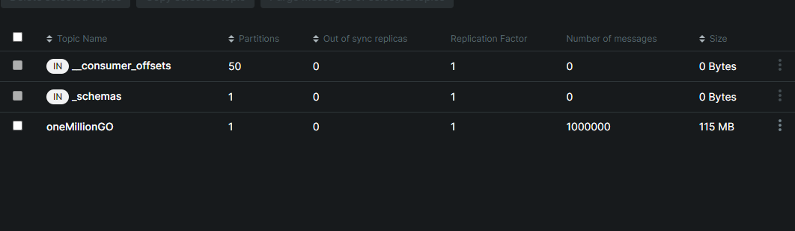

# Optimizing Kafka Topic Production with Fan-Out Pattern


### Project Challenge
The main challenge of this project is to optimize the production of Kafka topics and make the process of sending one million topics as fast as possible. This optimization involves fine-tuning the Kafka producer and efficiently distributing the tasks among workers using the Fan-Out pattern. Achieving this goal will significantly enhance the performance and scalability of the application.
This is the core idea of the project, and you will find here a basic implementation that needs to be optimized.

It is interesting to note that in JSON, the sending of 1 million topics, as seen from the captured log line: 1.8453342s
```text
INFO: 2024/07/16 13:56:15.026690 [main.go] [line:101] [GoroutineID: 58]  Sending batches to Kafka took  1.8453342s
```
while in Avro...?

The idea is : how much we can reduce the time ??

## Code Flow ( main.go )

### 1. Initialization

The program begins by recording the start time to measure the total execution time of the process. <br>
It then retrieves a list of users from a service that reads data from a CSV file. 
If an error occurs while reading the file, the program terminates.

### 2. Kafka Producer Configuration

A Kafka producer is configured to send the processed data to a specific topic. 
This producer is used to send messages containing the processed user data to a Kafka broker.

### 3. WaitGroup Setup

A `WaitGroup` is used to synchronize the workers. 
The `WaitGroup` tracks the number of active workers and ensures the main 
program waits for all workers to complete their tasks before terminating.

### 4. Creating and Splitting Channels

A main channel is created to send tasks to the workers. 
This main channel is then split into multiple smaller channels, one for each worker. 
This allows tasks to be evenly distributed among the workers.

### 5. Starting the Workers

Workers are started in parallel. 
Each worker listens to its respective channel for tasks to execute. 
When a worker receives a task, it executes the task and then waits for the next task.

### 6. Sending Tasks

Tasks are sent to the main channel. The tasks include:

- Writing users to a JSON file.
- Converting users to Avro format and writing to a file.
- Sending users to Kafka.

Each task is a function executed by the workers.

### 7. Waiting for Workers to Complete

The main program waits for all workers to complete their tasks using the `WaitGroup`. Once all workers have finished, the program can close the Kafka producer and terminate execution.

## Advantages of the Fan-Out Pattern

- **Parallelism**: Tasks are executed in parallel, reducing the overall execution time.
- **Scalability**: Adding more workers can further improve performance.
- **Efficiency**: Workers can be distributed across multiple resources, balancing the workload.

This design pattern is particularly useful in high-computation scenarios or when large amounts of data need to be processed efficiently.

## What is the Fan-Out Pattern?

The Fan-Out pattern is a design pattern used to distribute work among multiple workers. This pattern is particularly useful when dealing with workloads that can be broken down into independent tasks and executed in parallel to improve performance and efficiency.

## How the Fan-Out Pattern Works

The Fan-Out pattern is implemented by splitting a main channel into multiple smaller channels and assigning these channels to different workers to process tasks in parallel.

### Key Steps of the Fan-Out Pattern:

1. **Number of Workers (`numWorkers`)**: This number determines how many workers will be active to process the tasks. In the example, `numWorkers` is set to 3.

2. **Splitting the Main Channel**: The `Split` function takes the main channel and divides it into `numWorkers` channels. This is important for distributing tasks evenly among the workers.

3. **Distributing Tasks**: Tasks are sent to the main channel, and the `Split` function distributes them to the secondary channels in a round-robin manner. This ensures each worker receives a similar workload.

4. **Worker Execution**: Workers are goroutines that read from their respective channels and execute tasks. Each worker executes tasks concurrently, improving the overall efficiency of the program.

## Benefits of the Fan-Out Pattern

1. **Parallelism**: The primary advantage is that tasks are executed in parallel, reducing the total execution time compared to sequential execution.

2. **Load Balancing**: By splitting the work into multiple channels and assigning it to different workers, a more uniform load balancing is achieved. No worker is overloaded while others remain idle.

3. **Scalability**: This pattern allows easy scaling of the number of workers as needed. If more processing power is required, simply increase the `numWorkers`.

Imagine having a heavy task like processing one million user records. Doing it in a single goroutine would be slow. Using the Fan-Out pattern, you can split these records into blocks and assign them to multiple goroutines, significantly speeding up the process.


## Prerequisites

- Docker and Docker Compose installed
- Go installed (version 1.22.5 or later)

## Configuration Steps

### 1. Docker Compose Setup

Configure Docker Compose as needed for your environment. Make sure to have the necessary services defined, including Kafka.

### 2. Installing MSYS2

I encountered an issue similar to this: [Stack Overflow issue](https://stackoverflow.com/questions/60727208/undefined-kafka-components-for-go-kafka) and resolved it using MSYS2. MSYS2 provides a modern and compatible version of gcc that should resolve linking issues with librdkafka.

#### Steps to Install MSYS2:

1. **Download and Install MSYS2:**
   - Visit the [MSYS2 website](https://www.msys2.org) and download the installer.
   - Run the installer and follow the instructions to complete the installation.

2. **Update MSYS2 Packages:**
   - Open the MSYS2 shell (`MSYS2 MSYS`).
   - Update the base packages with the following commands:
     ```sh
     pacman -Syu
     pacman -Su
     ```

3. **Install gcc and make Packages:**
   - In the MSYS2 shell, run the command to install gcc and other necessary tools:
     ```sh
     pacman -S mingw-w64-x86_64-toolchain
     ```

4. **Configure the PATH:**
   - Add MSYS2 and mingw64 paths to the Windows PATH. Open Advanced System Settings and modify the environment variables:
      - `C:\msys64\mingw64\bin`
      - `C:\msys64\usr\bin`

5. **Verify gcc Installation:**
   - In a new PowerShell or Command Prompt window, verify that gcc is installed correctly by running:
     ```sh
     gcc --version
     ```

### 3. Compiling the Go Project

Now that gcc is correctly installed, you can compile your Go project with CGO enabled:

```powershell
$env:CGO_ENABLED=1; go build -o ....\csvreader\cmd\csv_app\csv_app.exe ...\csvreader\cmd\csv_app\main.go
```

## Running the Application

### 1. Build Docker and Start Docker Compose

First, build the Docker images and start the services defined in your Docker Compose file.

```sh
docker-compose build
docker-compose up -d
```

### Verify Kafka UI
   Ensure Kafka is running and accessible via the Kafka UI. Open your browser and navigate to http://localhost:8080 to check the status and operations of Kafka.
   


### Run the Program
   With Docker and Kafka running, you can now run your Go application. Navigate to the directory containing your Go project and execute the following command:

```sh
go run .\csvreader\cmd\csv_app\main.go
```


## ITA - Descrizione main.go

- 1) Creazione del canale principale mainCh: Questo canale viene utilizzato per inviare i task.
- 2) Suddivisione del canale principale: La funzione Split divide il canale principale in numWorkers canali secondari. Ogni canale secondario sarà gestito da un worker.
- 3) Avvio dei worker: Ogni worker è una goroutine che legge dal proprio canale secondario e esegue i task. I worker eseguono i task in parallelo.
- 4) Invio dei task: I task vengono inviati al canale principale mainCh dentro una goroutine, e la funzione Split si occupa di distribuire i task ai canali secondari in modo round-robin.
- 5) Esecuzione dei task: Ogni worker esegue i task letti dai canali secondari. Poiché i worker sono goroutine, eseguono i task in parallelo.

