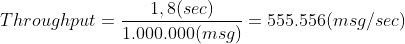
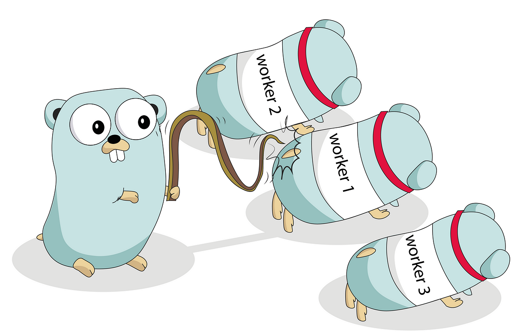

# Optimizing Kafka Topic Production with GO native concurrency 


### Project Challenge
The main challenge of this project is to optimize the production of Kafka topics and make the process of sending one million topics as fast as possible.<br>
This optimization involves fine-tuning the Kafka producer and efficiently distributing the tasks among workers using the Fan-Out pattern.<br>
Achieving this goal will significantly enhance the performance and scalability of the application.<br>
This is the core idea of the project, and you will find here my implementation.


It is interesting to note that in JSON, the sending of 1 million topics, as seen from the captured log line: 1.8648373s
```text
INFO: 2024/07/17 05:22:43.662764 [main.go] [line:101] [GoroutineID: 53]  Sending batches to Kafka took %s 1.8648373s

```

The idea is : how much we can reduce the time ??

## Kafka Performance Analysis

Sending 1 million messages to Kafka in 1.8 seconds is an impressive performance, indicating a very high throughput. However, it is important to consider several factors that can influence the sending time and overall performance:

### Throughput

To evaluate whether sending 1 million messages in 1.8 seconds is a good result, we can quickly calculate the throughput:



- **System Capability**: A system capable of processing over half a million messages per second is highly performant. This level of throughput suggests that the system is well-optimized for high-speed data ingestion and processing.

## How I Planned to Optimize the Flow and Precautions Taken to Achieve Maximum Performance
To achieve the best results and maximize performance, I implemented several optimizations in the flow:

- Use of the Fan-Out Pattern: This design pattern distributes work among multiple workers, allowing tasks to be executed in parallel, which improves performance and efficiency.
- Batch Processing for Topic Sending: By sending messages in batches, we reduce the overhead associated with frequent network calls and improve throughput.
- Asynchronous Logging: Logging operations are performed asynchronously to avoid blocking the main processing flow and to enhance overall system performance.
- Compression before sending to reduce bytes.
- Avoided using the standard json.Unmarshal library and promoted the use of ffjson, which according to the official documentation is 2-3 times faster and uses less memory.

## Description of the main.go and explanation of the main flow

The program begins by recording the start time to measure the total execution time of the process. <br>
It then retrieves a list of users from a service that reads data from a CSV file. 

A Kafka producer is configured to send the processed data to a specific topic. 
This producer is used to send messages containing the processed user data to a Kafka broker.

A `WaitGroup` is used to synchronize the workers. 
The `WaitGroup` tracks the number of active workers and ensures the main 
program waits for all workers to complete their tasks before terminating.

A main channel is created to send tasks to the workers. 
This main channel is then split into multiple smaller channels, one for each worker. 
This allows tasks to be evenly distributed among the workers.

Workers are started in parallel. 
Each worker listens to its respective channel for tasks to execute. 
When a worker receives a task, it executes the task and then waits for the next task.

The Fan-Out pattern is a design pattern used to distribute work among multiple workers. This pattern is particularly useful when dealing with workloads that can be broken down into independent tasks and executed in parallel to improve performance and efficiency.

Tasks are sent to the main channel. The tasks include:

- Writing users to a JSON file.
- Converting users to Avro format and writing to a file.
- Sending users to Kafka-Broker as Json.

In this context, it is important to understand that the two tasks of converting data to a JSON file and converting data to Avro format and writing it to a file are designed to run in parallel using separate Go-routines. This approach ensures that these tasks do not impact kafka-production times, as they are executed concurrently.




*Illustration created for “A Journey With Go”, made from the original Go Gopher, created by Renee French.*


The main program waits for all workers to complete their tasks using the `WaitGroup`. Once all workers have finished, the program can close the Kafka producer and terminate execution.

#### Advantages of the Fan-Out Pattern

- **Parallelism**: Tasks are executed in parallel, reducing the overall execution time.
- **Scalability**: Adding more workers can further improve performance.
- **Efficiency**: Workers can be distributed across multiple resources, balancing the workload.

## Prerequisites

- Docker and Docker Compose installed
- Go installed (version 1.22.5 or later)
- Unzip the users_million.rar

## Configuration Steps

### 1. Docker Compose Setup

Configure Docker Compose as needed for your environment. Make sure to have the necessary services defined, including Kafka.

### 2. Installing MSYS2 ( if you run it on windows.)

I encountered an issue similar to this: [Stack Overflow issue](https://stackoverflow.com/questions/60727208/undefined-kafka-components-for-go-kafka) and resolved it using MSYS2. MSYS2 provides a modern and compatible version of gcc that should resolve linking issues with librdkafka.

#### Steps to Install MSYS2:

1. **Download and Install MSYS2:**
   - Visit the [MSYS2 website](https://www.msys2.org) and download the installer.
   - Run the installer and follow the instructions to complete the installation.

2. **Update MSYS2 Packages:**
   - Open the MSYS2 shell (`MSYS2 MSYS`).
   - Update the base packages with the following commands:
     ```sh
     pacman -Syu
     pacman -Su
     ```

3. **Install gcc and make Packages:**
   - In the MSYS2 shell, run the command to install gcc and other necessary tools:
     ```sh
     pacman -S mingw-w64-x86_64-toolchain
     ```

4. **Configure the PATH:**
   - Add MSYS2 and mingw64 paths to the Windows PATH. Open Advanced System Settings and modify the environment variables:
      - `C:\msys64\mingw64\bin`
      - `C:\msys64\usr\bin`

5. **Verify gcc Installation:**
   - In a new PowerShell or Command Prompt window, verify that gcc is installed correctly by running:
     ```sh
     gcc --version
     ```

### 3. Compiling the Go Project

Now that gcc is correctly installed, you can compile your Go project with CGO enabled:

```powershell
$env:CGO_ENABLED=1; go build -o ....\csvreader\cmd\csv_app\csv_app.exe ...\csvreader\cmd\csv_app\main.go
```

## Running the Application

### 1. Build Docker and Start Docker Compose

First, build the Docker images and start the services defined in your Docker Compose file.

```sh
docker-compose build
docker-compose up -d
```

### Verify Kafka UI
Ensure Kafka is running and accessible via the Kafka UI. Open your browser and navigate to http://localhost:8080 to check the status and operations of Kafka.


### Run the Program
With Docker and Kafka running, you can now run your Go application. Navigate to the directory containing your Go project and execute the following command:


```sh
go mod tidy 
go run .\csvreader\cmd\csv_app\main.go
```

## Contributing

Contributions are welcome! If you have suggestions for improvements or new features, please open an issue or submit a pull request. When contributing, please follow these steps:

1. Fork the repository.
2. Create a new branch (e.g., `feature/your-feature-is-better-than-mine`).
3. Make your changes.
4. Commit your changes (`git commit -m 'Add some feature better than yours'`).
5. Push to the branch (`git push origin feature/your-feature-is-better-than-mine`).
6. Open a pull request.


## Conclusion

Here are some ideas for further improvements and considerations:

1. **Topic Production Times:** It would be useful to measure the production times for topics in Avro format.
2. **Topic Replication:** Using more replicas for topics could enhance data durability and availability.
3. **Error Handling:** Adding comprehensive error handling mechanisms would improve the robustness of the application.

## Author

**Andrea Cavallo**

## Keep in Contact

- [LinkedIn](https://it.linkedin.com/in/cavalloandrea88)
- [Medium](https://medium.com/@andreacavallo)
- [Github](https://github.com/Andrea-Cavallo)
- [Threads](https://www.threads.net/@2wes.wav)